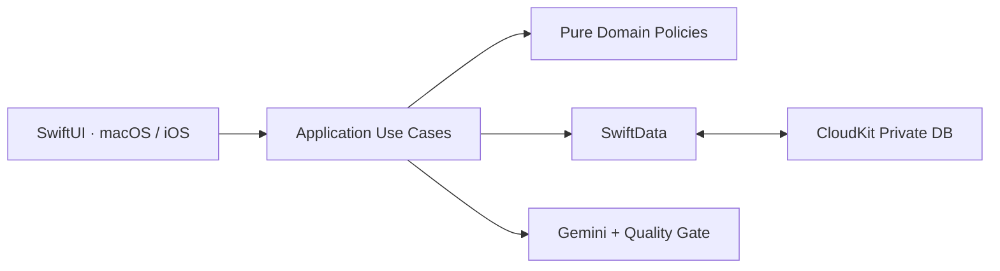

<div align="center">

# Vocab Officer

**AI를 활용해 학습 품질을 높인 macOS · iOS 네이티브 영단어 학습 앱**


</div>

Vocab Officer는 **매일 최대 100개 단어 학습**, **20문항 단위 반복 테스트**,
**Mac과 iPhone 간 학습 연속성**이라는 실제 사용자 문제를 해결하기 위해 만든 개인용 제품입니다.

## 핵심 기능

- **적응형 테스트**: 영→한·한→영 주관식, 4지선다 워밍업, 판정 보정,
  출제 빈도 균형화, 복습 우선순위와 숙달 상태 관리
- **빠른 단어 등록**: 일괄 붙여넣기와 다중 이미지 Vision OCR,
  누락 행 복구, 중복 표제어 의미 병합, SOT 직접 편집
- **AI 암기 도움**: Gemini 기반 어원·연상법·예문·유사어 비교 생성,
  품질 검증, 제한적 자동 재시도, 모델 fallback, quota cooldown 및 응답 캐싱
- **로컬 우선 동기화**: 기기별 SwiftData 저장소와 per-record CloudKit mirroring,
  변경분 조정, tombstone, 충돌 방지 및 로컬 복구 세대 관리
- **네이티브 UX**: 플랫폼별 SwiftUI 화면, 플립 카드, VoiceOver,
  macOS 키보드 중심 테스트 흐름

## 설계



도메인 정책을 UI·영속성·외부 서비스와 분리한 Clean Architecture를 적용했습니다.
동기화와 AI 요청은 UI 지연 경로에서 분리하고, 요약 상태를 활용해 전체 학습 이력의
반복 스캔을 줄였습니다. XCTest, 결정론적 동기화 fixture, 성능 허용 기준,
Swift 스타일 검사와 읽기 전용 감사 절차로 변경 품질을 검증합니다.

## 실행

요구 환경: Xcode 26+, Apple Development Team, 동기화용 iCloud Container

```bash
git clone git@github.com:Remaked-Swain/Vocab-Officer.git
cd Vocab-Officer

# macOS 테스트
xcodebuild -project Vocab.xcodeproj -scheme Vocab \
  -destination 'platform=macOS' CODE_SIGNING_ALLOWED=NO test

# /Applications/Vocab.app 빌드·설치·실행
./script/build_and_run.sh --install-verify
```

iOS 타깃은 `VocabIOS`입니다. Xcode에서 개발 팀과 실기기를 선택해 실행할 수 있습니다.

---

사용자 문제를 **OCR 입력 자동화**, **도메인 기반 복습 정책**, **LLM 응답 품질 파이프라인**,
**증분 동기화**로 구체화하며 아이디어부터 멀티플랫폼 네이티브 제품까지 완성했습니다.
